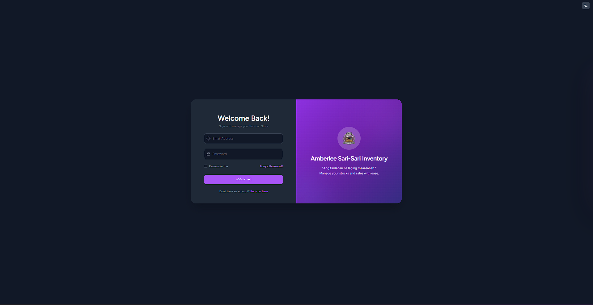
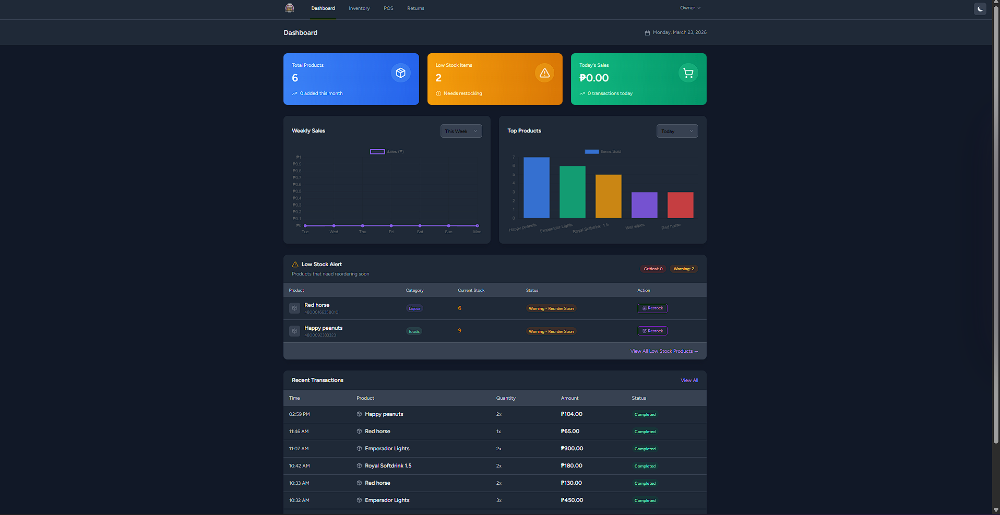
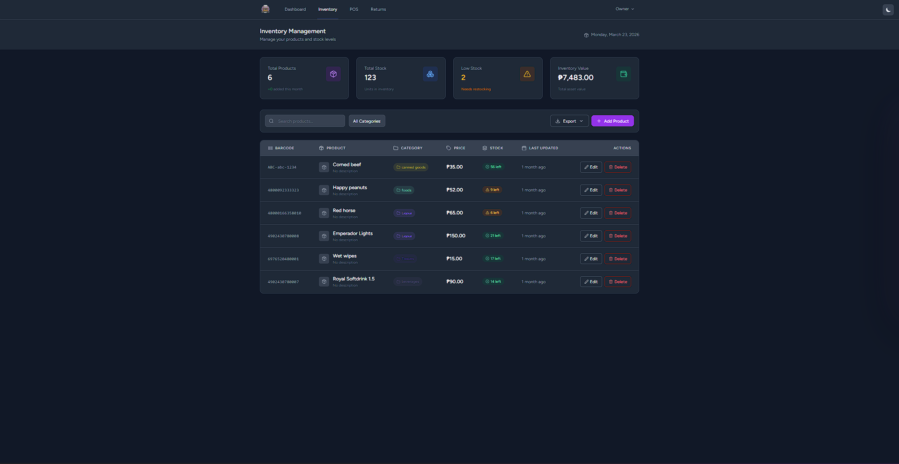
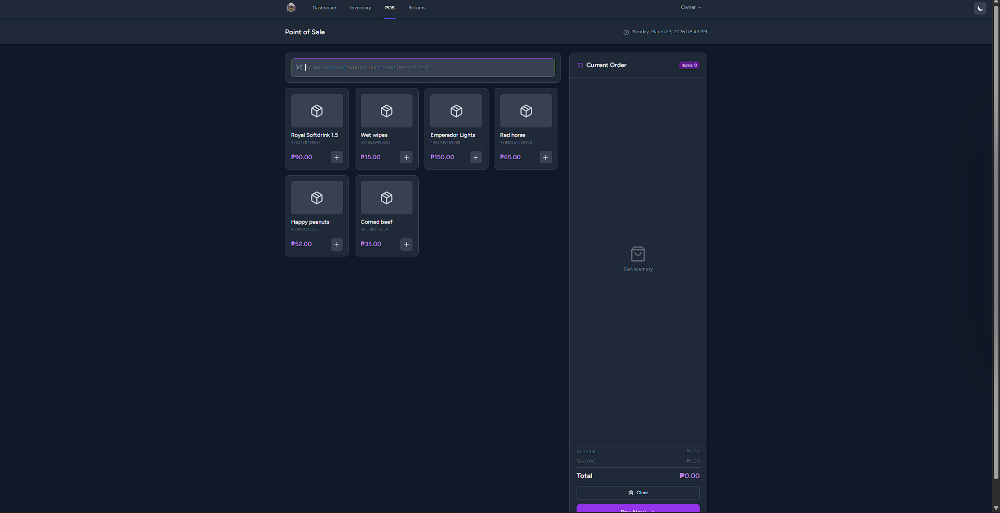

<p align="center">
  
</p>

<p align="center">
  
  
  
  
  
</p>

# 🏪 Sari-Sari Inventory Management System

A comprehensive Point of Sale (POS) and Inventory Management System designed specifically for **sari-sari stores** (neighborhood retail shops). This system helps micro-entrepreneurs streamline daily operations, track stock levels, and monitor profitability through an easy-to-use interface.

> [!IMPORTANT]
> **Offline-First System:** This project is designed to run entirely on a **local environment**. It is provided as source code for local deployment, ensuring your data stays on your machine without requiring a constant internet connection.

---

## ✨ Features

* **🔐 User Authentication** – Secure local login for store owners and staff.
* **📊 Dashboard Analytics** – Real-time visual insights on sales and daily transactions.
* **📦 Inventory Management** – Complete CRUD operations for products with automated stock tracking.
* **🛒 Point of Sale (POS)** – Optimized interface for quick customer checkouts.
* **🔄 Returns Processing** – Efficient handling of customer returns and inventory adjustments.
* **📈 Sales Reporting** – Generate and view reports for daily, weekly, and monthly performance.
* **⚠️ Low Stock Alerts** – Instant visual notifications when items need restocking.

---

## 📸 Screenshots

| Login Page | Dashboard |
|---|---|
|  |  |

| Inventory | POS System |
|---|---|
|  |  |

---

## 🛠️ Built With

* **Framework:** [Laravel 11](https://laravel.com)
* **Database:** MySQL
* **Frontend:** Bootstrap 5 & jQuery
* **Charts:** Chart.js

---

## 🚀 Installation Guide (Local Setup)

Since this is a local source-code project, follow these steps to get it running on your machine:

1.  **Clone the Repository**
    ```bash
    git clone [https://github.com/Xrid-driX/sari-sari-inventory.git](https://github.com/Xrid-driX/sari-sari-inventory.git)
    cd sari-sari-inventory
    ```

2.  **Install Dependencies**
    ```bash
    composer install
    npm install && npm run build
    ```

3.  **Environment Configuration**
    * Copy the example env file:
        * **Windows:** `copy .env.example .env`
        * **Mac/Linux:** `cp .env.example .env`
    * Configure your local MySQL settings in `.env`:
        ```env
        DB_DATABASE=sari_sari_db
        DB_USERNAME=root
        DB_PASSWORD=your_password
        ```

4.  **Initialize Database**
    ```bash
    php artisan key:generate
    php artisan migrate --seed
    ```

5.  **Run the Local Server**
    ```bash
    php artisan serve
    ```
    Access the app at: `http://127.0.0.1:8000`

**Default Credentials:**
* **Email:** `test@user.com`
* **Password:** `admin123`
* Or Just click register on log in page

---

## 📁 Project Structure

```text
sari-sari-inventory/
├── app/
│   ├── Models/             # Database Logic
│   ├── Http/Controllers/   # Route Handling
│   └── Services/           # Business Logic
├── database/
│   ├── migrations/         # Table Schemas
│   └── seeders/            # Initial Demo Data
├── resources/
│   ├── views/              # Blade Templates (UI)
│   └── css/                # Stylesheets
├── public/
│   └── images/             # Static Assets & Screenshots
└── routes/                 # Web Endpoints
```
# 📄 License
This project is open-source software licensed under the MIT license.

Author: Xrid-Drix
